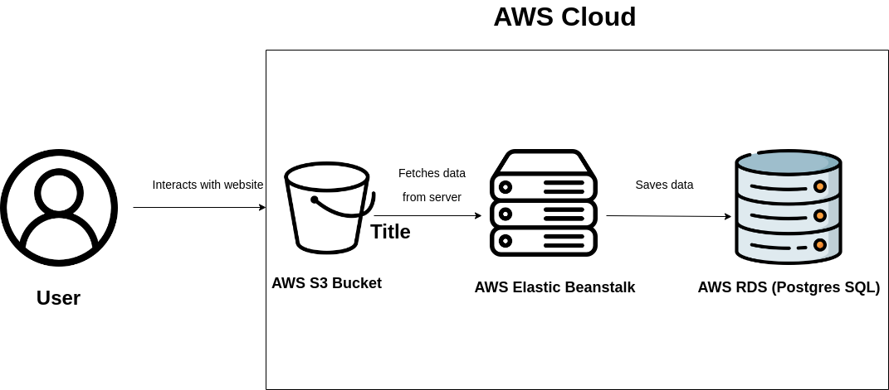
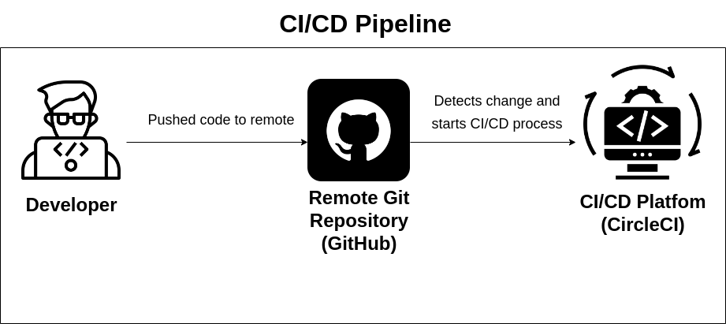

# Udagram

A simple website for uploading your photos with sign up functionality.

[Udagram Website](http://image-filtering-bucket-944182564155.s3-website-us-east-1.amazonaws.com/home)

### Code Structure

At the **root**, we have CircleCI pipeline configuration and main scripts in package.json.

In **udagram**, there are two folders.

1- udagram-api: Backend
2- udagram-frontend: Frontend

### Dependencies

```
- Node v14.20.0 (LTS) or more recent. While older versions can work it is advisable to keep node to latest LTS version

- npm 6.14.17 (LTS) or more recent, Yarn can work but was not tested for this project

- AWS CLI v2, v1 can work but was not tested for this project

- A RDS database running Postgres.

- A S3 bucket for hosting uploaded pictures.

```

### Cloud Architecture



### Pipeline Diagram


### Installation

#### Local run (for development purposes):

1- Create a postgres database

2- Create a ```set_env.sh``` file in **udagram** folder and export the following environment variables:

```bash
export POSTGRES_USERNAME=$
export POSTGRES_PASSWORD=$
export POSTGRES_HOST=$
export POSTGRES_DB=$
export JWT_SECRET=$
```
Fill the $ with your values. and ```source set_env.sh```

3- Start the backend then start the frontend. At the project root:
```npm run api:start && npm run frontend:start```

You can access the page after starting the server at ```localhost:4200```

#### Deploying on the cloud
Provision the necessary AWS services needed for running the application:

1. In AWS, provision a publicly available RDS database running Postgres.
2. In AWS, provision a s3 bucket for hosting the uploaded files.
3. Export the ENV variables by creating a ```set_env.sh``` file in **udagram** folder
```bash
export POSTGRES_USERNAME=$
export POSTGRES_PASSWORD=$
export POSTGRES_HOST=$
export POSTGRES_DB=$
export AWS_BUCKET=$
export AWS_REGION=$
export AWS_PROFILE=$
export JWT_SECRET=$
```
1. At the root, ```npm run deploy```. Then you can access the url in the created s3 bucket (Make sure to enable static hosting)
## Testing

This project contains two different test suite: unit tests and End-To-End tests(e2e). Follow these steps to run the tests.

1. `cd starter/udagram-frontend`
1. `npm run test`
1. `npm run e2e`

There are no Unit test on the back-end

### Tests:

Frontend:

Unit tests are using the Jasmine Framework.
```cd udagram/udagram-frontend && npm run test```

The e2e tests are using Protractor and Jasmine.
```cd udagram/udagram-frontend && npm run e2e```

Backend:

Tests not implemented
## Built With

- [Angular](https://angular.io/) - Single Page Application Framework
- [Node](https://nodejs.org) - Javascript Runtime
- [Express](https://expressjs.com/) - Javascript API Framework

## License

[License](LICENSE.txt)
