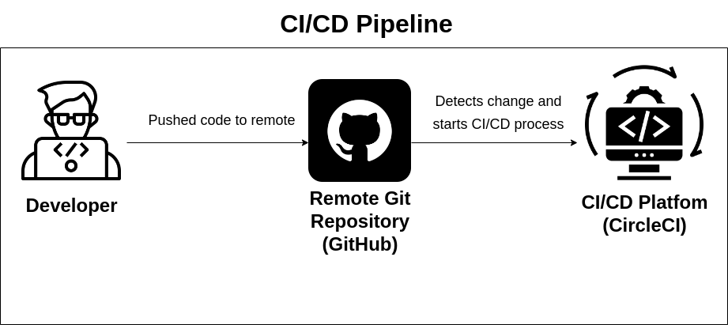

# Pipeline

At the last step, the process of CI/CD is controlled by [CircleCI configuration](../.circleci/config.yml)

## Pipeline Workflow

There are two jobs in the workflow of the CI/CD pipeline.

1. Build: Installs dependencies and build application of both frontend and backend
2. Deploy: Deploys the application after the build job into AWS

**Note**: Manual approval required after build a successful build job before proceeding into deployment. Also, the CI/CD pipeline only triggers on the main (master) branch